# E/F/MNIST-AC-GAN

This project explores the possibility of using a GAN network to not only generate realistic imitation images for a specific data source, but also define features this imitation should have. Although other methods exist to realize this type of model, a [AC-GAN (Auxiliary Classifier GAN)](https://arxiv.org/abs/1610.09585) has been implemented.

## GAN

Generative-Adversarial-Networks are a method of semi-supervised learning.
Within a GAN network two neural networks work against each other:

1. a discriminator NN, which tries to determine if a randomly given sample is
real or produced by the generator
2. a generator NN, which tries to create images that pass the discriminators test

Through each training cycle the discriminator is given real and fake data,
in order to distinguish between them. The generator is then trained on a random
latent input to produce images that the discriminator is tested on. By continuously refining both models weights, the generator is able to produce images that can be (almost) indistinguishable from the real dataset.

The focus of a classical GAN architecture is on the creation of realisitic imitation images, but no control of the image content is given a priory. The AC-GAN adds an additional input component to the generator, namely what class to produce. The discriminator then not only predicts if a sample is real or not, but also what class the sample belongs to.

## Auxiliary Classifier GAN Model

The goal of the model is to reduce the computational footprint as much as possible in a first attempt. The image generation starts from a latent space vector of shape 100, and upsamples a 7x7 image twice to reach 28x28.

The discriminator is roughly the reversed equivalent, downsampling by a stride of 2 from 28x28 through 14x14 to 7x7 before making an estimate on realness and class.

The models utilize LeakyReLU activation functions and a dropout of 40% per CNN layer. Especially within the discriminator, a batch normalization decreases accuracy convergence significantly.

More implemented features:
1. A `tanh` activation is used in the last step of the generator
1. Label smoothing is applied (0.9 for real, -0.9 for fake)

Generator Model      | Discriminator Model
:-------------------:|:-------------------:
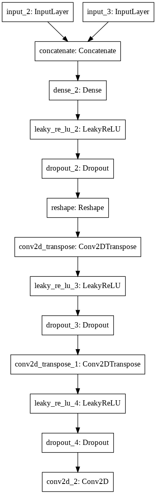 | 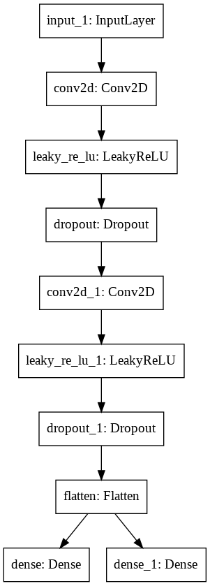

Discriminator:

    Model: "d_model"
    __________________________________________________________________________________________________
    Layer (type)                    Output Shape         Param #     Connected to                     
    ==================================================================================================
    input_1 (InputLayer)            [(None, 28, 28, 1)]  0                                            
    __________________________________________________________________________________________________
    conv2d (Conv2D)                 (None, 14, 14, 64)   1088        input_1[0][0]                    
    __________________________________________________________________________________________________
    leaky_re_lu (LeakyReLU)         (None, 14, 14, 64)   0           conv2d[0][0]                     
    __________________________________________________________________________________________________
    dropout (Dropout)               (None, 14, 14, 64)   0           leaky_re_lu[0][0]                
    __________________________________________________________________________________________________
    conv2d_1 (Conv2D)               (None, 7, 7, 64)     65600       dropout[0][0]                    
    __________________________________________________________________________________________________
    leaky_re_lu_1 (LeakyReLU)       (None, 7, 7, 64)     0           conv2d_1[0][0]                   
    __________________________________________________________________________________________________
    dropout_1 (Dropout)             (None, 7, 7, 64)     0           leaky_re_lu_1[0][0]              
    __________________________________________________________________________________________________
    flatten (Flatten)               (None, 3136)         0           dropout_1[0][0]                  
    __________________________________________________________________________________________________
    dense (Dense)                   (None, 1)            3137        flatten[0][0]                    
    __________________________________________________________________________________________________
    dense_1 (Dense)                 (None, 10)           31370       flatten[0][0]                    
    ==================================================================================================
    Total params: 101,195
    Trainable params: 101,195
    Non-trainable params: 0
    __________________________________________________________________________________________________

Generator:

    Model: "g_model"
    __________________________________________________________________________________________________
    Layer (type)                    Output Shape         Param #     Connected to                     
    ==================================================================================================
    input_2 (InputLayer)            [(None, 10)]         0                                            
    __________________________________________________________________________________________________
    input_3 (InputLayer)            [(None, 90)]         0                                            
    __________________________________________________________________________________________________
    concatenate (Concatenate)       (None, 100)          0           input_2[0][0]                    
                                                                     input_3[0][0]                    
    __________________________________________________________________________________________________
    dense_2 (Dense)                 (None, 3136)         316736      concatenate[0][0]                
    __________________________________________________________________________________________________
    leaky_re_lu_2 (LeakyReLU)       (None, 3136)         0           dense_2[0][0]                    
    __________________________________________________________________________________________________
    dropout_2 (Dropout)             (None, 3136)         0           leaky_re_lu_2[0][0]              
    __________________________________________________________________________________________________
    reshape (Reshape)               (None, 7, 7, 64)     0           dropout_2[0][0]                  
    __________________________________________________________________________________________________
    conv2d_transpose (Conv2DTranspo (None, 14, 14, 64)   65600       reshape[0][0]                    
    __________________________________________________________________________________________________
    leaky_re_lu_3 (LeakyReLU)       (None, 14, 14, 64)   0           conv2d_transpose[0][0]           
    __________________________________________________________________________________________________
    dropout_3 (Dropout)             (None, 14, 14, 64)   0           leaky_re_lu_3[0][0]              
    __________________________________________________________________________________________________
    conv2d_transpose_1 (Conv2DTrans (None, 28, 28, 64)   65600       dropout_3[0][0]                  
    __________________________________________________________________________________________________
    leaky_re_lu_4 (LeakyReLU)       (None, 28, 28, 64)   0           conv2d_transpose_1[0][0]         
    __________________________________________________________________________________________________
    dropout_4 (Dropout)             (None, 28, 28, 64)   0           leaky_re_lu_4[0][0]              
    __________________________________________________________________________________________________
    conv2d_2 (Conv2D)               (None, 28, 28, 1)    3137        dropout_4[0][0]                  
    ==================================================================================================
    Total params: 451,073
    Trainable params: 451,073
    Non-trainable params: 0
    __________________________________________________________________________________________________

## MNIST Dataset

One of the most popular and academic entrances into deep learning involves the
MNIST dataset. The data contains balanced 70.000 samples of hand-written digits
that can be used as a basis for CNN classification methods. The data is widely
available and requires no noteworthy cleaning or preprocessing to be worked with.

real data:

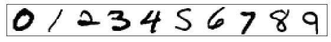

generated data after 5/30/50/100 epochs:

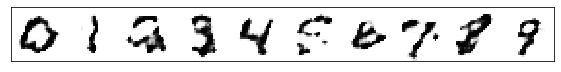
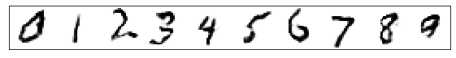
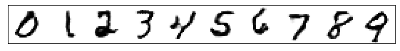
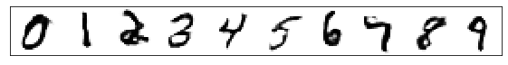

## Fashion-MNIST

Zalando-Research provides a dataset that is highly similar in structure to the MNIST-Digit dataset. Instead of 10 classes containg digits, the F-MNIST dataset contains classes of clothing (e.g. boots, shirts, pants, etc.).

Due to the input shape and classification labels being identical to the MNIST set, the model can be used 1:1 without any modifications apartfrom adjusting for number of total samples.

real data:

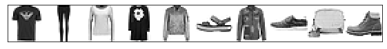

generated data after 5/30/50/100 epochs:

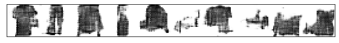
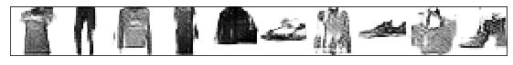
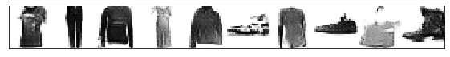
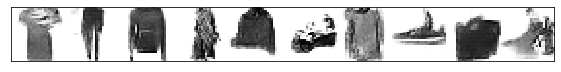

## Extended-MNIST

The E-MNIST dataset is the original dataset the MNIST-digits set was originally derived from. There are multiple versions of the dataset available that contain digits, letters in lower and upper case. The full dataset, `emnist-byclass` contains a total of 62 classes (10 digits, 26 lower-case letter and 26 upper-case letters). This dataset is not balanced though with a lowest to highest number of sample ratio of over 10.

A balanced dataset of `letters` only is also available, containing 26 classes of merged capital and lower-case letters. Both dataset are being considered.

### Letters Dataset

The letters dataset combines lower and upper case letters into the same class. Although the set is balanced, an obvious issue arises. Some letters differ significantly in their writing between upper and lower case. Although the GAN is able to produce clean letters, some are practically illegible (e.g. upper and lower-case `Q/q`).

real data (random order):
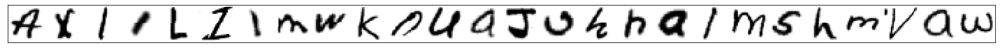

generated data after 5/30/50/100 epochs:
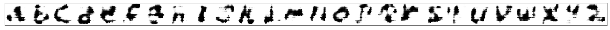
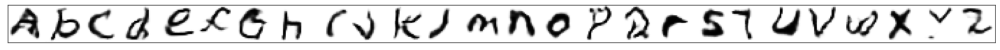
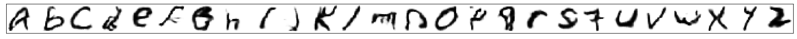
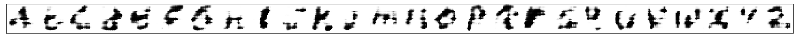

### ByClass Dataset

Even though the dataset `ByClass` is unbalanced, each letter is captured in upper and lower-case writing style.

This dataset experiences mode collapse!

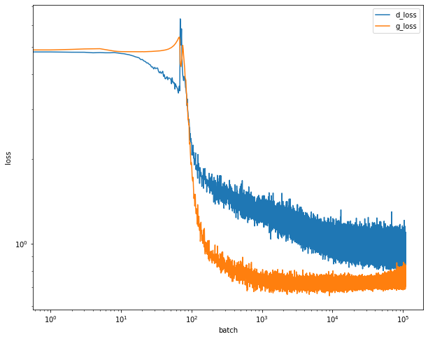

real data (random order):
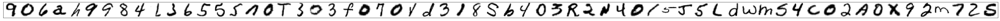

generated data after 5/30/50/100 epochs:
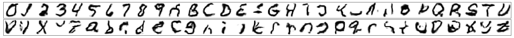

## References/Resources

* [Fashion MNIST Dataset](https://research.zalando.com/welcome/mission/research-projects/fashion-mnist/)
* [Zalando Research - FMINST](https://research.zalando.com/welcome/mission/research-projects/fashion-mnist/)
* [FMNIST Github](https://github.com/zalandoresearch/fashion-mnist)
* [EMNIST Dataset](https://www.nist.gov/itl/products-and-services/emnist-dataset)
* [EMNIST Paper](https://arxiv.org/abs/1702.05373v1)
* [AC-GAN Paper](https://arxiv.org/abs/1610.09585)
