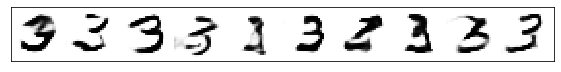
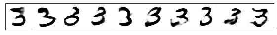

# E/F/MNIST - GAN

## Nomenclature

X     images
y     one-hot-vector classification
z     noise vector
w     real/fake classification

## AE-AC-GAN Model

## Assumptions

* Real samples get label 1, fake get label 0
* Feature smoothing (real = 0.9, fake = 0.1)
* Latent noise vector in interval [0,1]
* Images normalized to [-1,1] (tanh)
* GaussianNoise is added to input images (stddev = 0.05)

* binary-crossentropy is used for binary classification, i.e. real or fake images
* categorical-crossentropy is used for one-hot encoded classification of images
* autoencoder uses MAE (MSE creates slightly blurry images)

* Generator, discriminator and encoder to use LeakyReLU and Dropout (BatchNormalization causes issues in convergence and mode collapse)

# MNIST dataset

Learning curve:

Auto-encoder performance (5, 10, 15 epochs):

Generator variablibity (5, 10, 15 epochs):

Generator performance:

# EMNIST dataset

The model (128 depth) has some issues getting started. Some initialization configurations may speed up model convergence. After ~10 epochs (~1100 batches per epoch), no significant improvement in image quality is seen.

Learning curve:

Auto-encoder performance (5, 10, 15 epochs):

Generator variablibity (5, 10, 15 epochs):

Generator performance:

