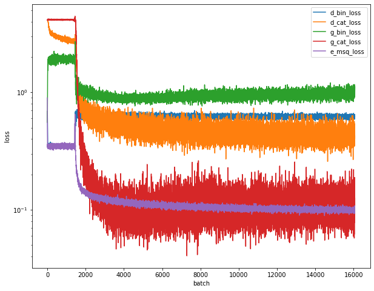

# E/F/MNIST-GAN

This project explores the possibility of using a GAN network to not only generate realistic imitation images for a specific data source, but also define features this imitation should have. Although other methods exist to realize this type of model, a AC-GAN (Auxiliary Classifier GAN) has been implemented.

## GAN

Generative-Adversarial-Networks are a method of semi-supervised learning.
Within a GAN network two neural networks work against each other:

1. a discriminator NN, which tries to determine if a randomly given sample is
real or not
2. a generator NN, which tries to create images that pass the discriminators test

Through each training cycle the discriminator is given real and fake data,
in order to distinguish between them. The generator is then trained on a random
latent input to produce images that the discriminator is tested on.

## Auxiliary Classifier GAN Model

TBD

## MNIST Dataset

One of the most popular and academic entrances into deep learning involves the
MNIST dataset. The data contains balanced 70.000 samples of hand-written digits
that can be used as a basis for CNN classification methods. The data is widely
available and requires no noteworthy cleaning or preprocessing to be worked with.

real data:

generated data after 5/30/100 epochs:

## Fashion-MNIST

Zalando-Research provides a dataset that is highly similar in structure to the MNIST-Digit dataset. Instead of 10 classes containg digits, the F-MNIST dataset contains classes of clothing (e.g. boots, shirts, pants, etc.).

Due to the input shape and classification labels being identical to the MNIST set, the model can be used 1:1 without any modifications apartfrom adjusting for number of total samples.

real data:

generated data after 5/30/100 epochs:

## Extended-MNIST

The E-MNIST dataset is the original dataset the MNIST-digits set was originally derived from. There are multiple versions of the dataset available that contain digits, letters in lower and upper case. The full dataset, `emnist-byclass` contains a total of 62 classes (10 digits, 26 lower-case letter and 26 upper-case letters). This dataset is not balanced though with a lowest to highest number of sample ratio of ...

real data:

generated data after 5/30/100 epochs:

## References
