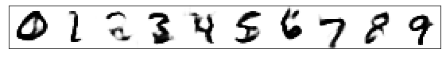
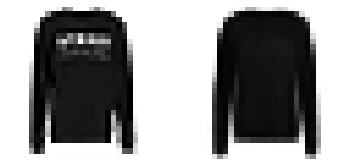
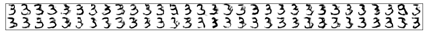

# E/F/MNIST - GAN

This projects attempts to teach a GAN model to write text in a handwritten style.
Initial concept studies are presented based on MNIST and Fashion-MNIST datasets,
before ultimately switching to the Extended-MNIST dataset for handwriting examples.

Although more fine-tuning will likely produce qualitatively better results, the
code documented here is considered a proof of concept only.

## AE-AC-GAN Model

A classical GAN model learns to generate images that look realistic by playing
two specialized neural networks against each other. A generator takes a latent
noise vector (with no explicit meaning) as input and tries to produce a
realistic image. The second neural network tries to discriminate if a given
image is from the real dataset, or produced by the generator. In theory both
networks, by trying to outsmart each other, continuously improve them-selves.

The classical GAN network would produce a random image that is indistinguishable
from images of the original dataset. In order to allow for a control of the output,
a auxiliary classifier is implemented: The generator takes the latent noise vector,
as well as a intended class (one-hot-encoded) input, and the discriminator tries
to determine the "fakeness" of the image, as well as it's class. Therefore two
loss functions are supplied for the discriminator output, that the model is
trained on.

A major hurdle in GAN structures is mode-collapse. Under certain conditions, the
generator may learn to produce an image output that is independent of the latent
noise vector (e.g. the weights of the first layer are 0). The output image, although
realistic, shows no variations, effectively producing the same image over and over.
In order to circumvent this collapse, multiple architectures have been introduced.
For this project specifically, a auto-encoder type network is stacked onto the
Auxiliary-Classifier GAN.

In the model shown below, the generator is trained from both sides: on one side
the GAN as described above is trained, on the other the auto-encoder tries to
produce a mirror-perfect representation of the input image. The generator is
thereby forced to use the reduced space vector (latent noise vector for GAN),
effectively suppressing full mode collapse.

Training is therefore defined in 3 steps, per batch: discriminator training on real and fake data (orange), generator training on latent noise vector and class where discriminator is frozen (green) and auto-encoder training on real images (red).

## Nomenclature

* **X**:     images
* **y**:     one-hot-vector classification
* **z**:     latent noise vector
* **w**:     real/fake classification

## Assumptions

* Real samples get label 1, fake get label 0
* Feature smoothing (real = 0.9, fake = 0.1)
* Latent noise vector in interval [0,1]
* Images normalized to [-1,1] (tanh)
* GaussianNoise is added to input images (stddev = 0.05)
* binary-crossentropy is used for binary classification, i.e. real or fake images
* categorical-crossentropy is used for one-hot encoded classification of images
* autoencoder uses MAE (MSE creates slightly blurry images)
* Generator, discriminator and encoder to use LeakyReLU and Dropout (BatchNormalization causes issues in convergence and mode collapse). This is likely the largest lever to improve image quality in future developments.

# MNIST dataset

The MNIST dataset is likely one of the most popular image datasets in deep learning.
It consists of a total of 70.000 hand written digits in a balanced dataset.

### Learning curve:

The loss curves show no significant change after about 2000 batches (~5 epochs). The loss function though may not be a representative measure of quality, as the models are continuously fighting against each other.

### Auto-encoder performance (5, 10, 15 epochs):

\
\

The autoencoder is able to reproduce the input image at an acceptable quality early on.

### Generator variablibity (5, 10, 15 epochs):

The model shows no indication of mode collapse, even in later epochs. The image quality though does not appear to improve significantly after ~10 epochs.

### Generator performance:

The model does produce digits with significant variability early on, that are legible. Further training shows no significant qulitative improvement of digits.

# Fashion-MNIST dataset

To test the method on a dataset comparable in structure to the MNIST dataset, the Fashion-MNIST set contains 10 classes of fashion items that can be used as input in the same method as above.

### Learning curve:

The learning curve behaves very similar to the MNIST case.

### Auto-encoder performance (5, 10, 15 epochs):

\
\

Similarly to the MNIST case, the auto-encoder performs well early on. Notably, the auto-encoder has some trouble describing patterns or prints on clothing.

### Generator variablibity (5, 10, 15 epochs):

Variability is still given, showing no indication of mode collapse/.

### Generator performance:

Images generated around ~epochs do not seem to improve in quality with further training.

# EMNIST dataset

To predict handwriting the Extended-MNIST dataset contains a total of 62 classes. These classes are balanced at the time of training in order to reduce any class imbalance effects. A total of ~2200 samples per class can be extracted from the dataset.

The model (128 depth) has some issues getting started. Some initialization configurations may speed up model convergence. After ~10 epochs (~1100 batches per epoch), no significant improvement in image quality is seen.

### Learning curve:

It seems for the generator to take a while to produce images that can fool the discriminator. Once this happens, a sharp decline in loss can be seen for all functions except the discriminators binary classifier.

### Auto-encoder performance (5, 10, 15 epochs):

\
\

As in the cases before, the auto-encoder is able to reproduce the input image early on.

### Generator variablibity (5, 10, 15 epochs):

Due to the increased number of classes, a classical AC-GAN faces likely partial or full mode collapse with the given dataset. The auto-encoder architecture is able to suppress this effect.

### Generator performance:

Similarly to the MNIST and FMNIST cases, no significant qualitative improvements can be seen in the generator after ~10 epochs. Although the writing is legible, the quality is not yet sufficient to produce handwritten text that could fool a "human Turing test". With further improvements to the method, hyper-parameter tuning and data augmentation a realistic handwriting style could be possible.
